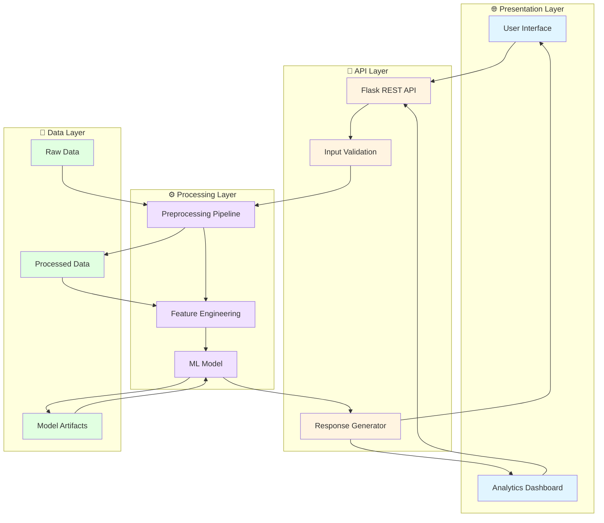
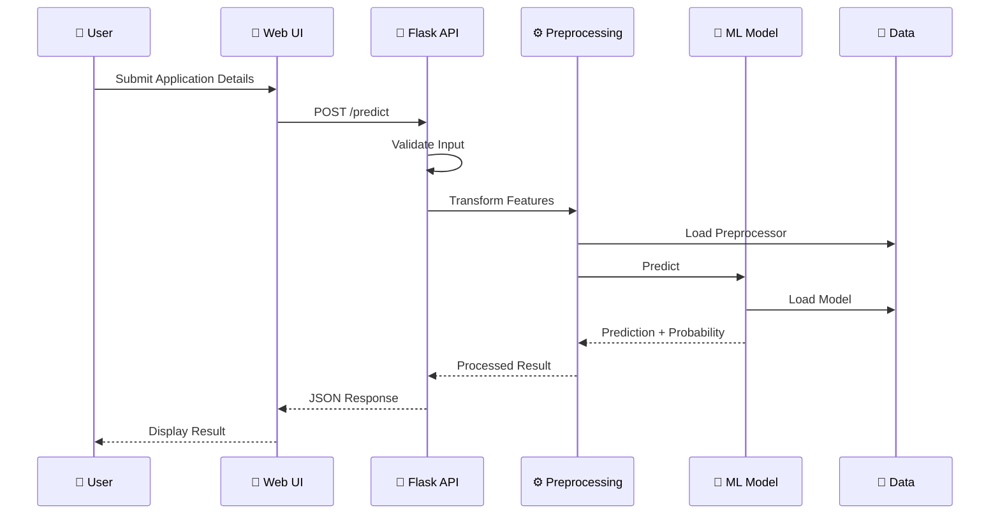

<div align="center">

# 🎯 Visa Approval Prediction

### A Production-Style Machine Learning Web Application


**Predict whether an H-1B visa application is likely to be CERTIFIED or DENIED using Machine Learning**

[](https://www.python.org/)
[](https://flask.palletsprojects.com/)
[](https://scikit-learn.org/)
[](https://pandas.pydata.org/)
[](https://www.docker.com/)

</div>

---

## 📋 Table of Contents

- [🎯 Project Overview](#-project-overview)
- [🔍 Problem Statement](#-problem-statement)
- [🎯 Objectives](#-objectives)
- [🏗️ Architecture](#️-architecture)
- [📊 Dataset](#-dataset)
- [⚙️ Features](#️-features)
- [🧹 Data Preprocessing](#-data-preprocessing)
- [🔧 Feature Engineering](#-feature-engineering)
- [📈 Exploratory Data Analysis](#-exploratory-data-analysis)
- [🤖 Machine Learning Models](#-machine-learning-models)
- [📊 Model Evaluation](#-model-evaluation)
- [🌐 Flask Application](#-flask-application)
- [📡 API Documentation](#-api-documentation)
- [📁 Project Structure](#-project-structure)
- [🚀 Installation](#-installation)
- [💻 Running Locally](#-running-locally)
- [🐳 Docker Setup](#-docker-setup)
- [🧪 Testing](#-testing)
- [⚠️ Limitations](#️-limitations)
- [🔮 Future Improvements](#-future-improvements)
- [⚖️ Disclaimer](#️-disclaimer)
- [👨‍💻 Author](#-author)

---

## 📋 Table of Contents

- [Project Overview](#project-overview)
- [Problem Statement](#problem-statement)
- [Objectives](#objectives)
- [Architecture](#architecture)
- [Dataset](#dataset)
- [Features](#features)
- [Data Preprocessing](#data-preprocessing)
- [Feature Engineering](#feature-engineering)
- [Exploratory Data Analysis](#exploratory-data-analysis)
- [Machine Learning Models](#machine-learning-models)
- [Model Evaluation](#model-evaluation)
- [Flask Application](#flask-application)
- [API Documentation](#api-documentation)
- [Project Structure](#project-structure)
- [Installation](#installation)
- [Running Locally](#running-locally)
- [Docker Setup](#docker-setup)
- [Testing](#testing)
- [Limitations](#limitations)
- [Future Improvements](#future-improvements)
- [Disclaimer](#disclaimer)

## 🎯 Project Overview

This project implements an **end-to-end ML prediction system** for H-1B visa case outcomes. It demonstrates a complete ML lifecycle including data preprocessing, feature engineering, model training, evaluation, and deployment as a web application.

### ✨ Key Features

- 🤖 **ML-Powered Predictions** - Uses trained classification models to predict visa outcomes
- 📊 **Multiple Model Comparison** - Evaluates Logistic Regression, Decision Tree, Random Forest, and Gradient Boosting
- 🎨 **Professional Web Interface** - Clean, responsive UI for making predictions
- 📈 **Analytics Dashboard** - Visual insights into dataset and model performance
- 🔌 **REST API** - JSON API for programmatic access
- 🐳 **Docker Support** - Containerized deployment for easy setup
- 🛡️ **Production-Ready** - Includes logging, error handling, and input validation

## 📊 Problem Statement

H-1B visa applications involve complex evaluation processes based on various factors including employer information, job details, prevailing wages, and worksite location. This project aims to build a machine learning model that can estimate the likelihood of visa approval based on historical data patterns.

## 🎯 Objectives

1. Load and analyze H-1B visa dataset
2. Perform comprehensive data cleaning and preprocessing
3. Handle missing values and categorical variables
4. Perform exploratory data analysis (EDA)
5. Engineer meaningful features
6. Train and compare multiple classification models
7. Select the best-performing model
8. Deploy as a Flask web application
9. Provide predictions with confidence scores
10. Create an analytics dashboard

## 🏗️ Architecture

### System Architecture Diagram



### Data Flow Diagram



### Training Pipeline

```mermaid
graph LR
    A[📥 Raw Data] --> B[🧹 Data Cleaning]
    B --> C[🔍 EDA]
    C --> D[⚙️ Feature Engineering]
    D --> E[🔀 Train-Test Split]
    E --> F[🤖 Model Training]
    F --> G[📊 Model Evaluation]
    G --> H[🏆 Model Selection]
    H --> I[💾 Save Artifacts]
    
    style A fill:#ffe1e1
    style B fill:#fff4e1
    style C fill:#e1f5ff
    style D fill:#f0e1ff
    style E fill:#e1ffe1
    style F fill:#ffe1f0
    style G fill:#f0e1ff
    style H fill:#fff4e1
    style I fill:#e1ffe1
```



### System Components

| Layer | Components | Technology |
|-------|-----------|------------|
| **🌐 Presentation** | Web UI, Analytics Dashboard | HTML5, CSS3, JavaScript, Jinja2 |
| **🔌 API** | REST API, Validation, Response | Flask, Flask-CORS |
| **⚙️ Processing** | Preprocessing, Feature Engineering, ML | scikit-learn, pandas, NumPy |
| **💾 Data** | Raw Data, Processed Data, Artifacts | CSV, PKL, JSON |

## 📁 Dataset

The project uses H-1B visa dataset containing the following fields:

- `CASE_STATUS`: Target variable (CERTIFIED/DENIED)
- `EMPLOYER_NAME`: Name of the employer
- `SOC_NAME`: Standard Occupational Classification
- `JOB_TITLE`: Job title
- `FULL_TIME_POSITION`: Full-time position indicator (Y/N)
- `PREVAILING_WAGE`: Prevailing wage for the position
- `YEAR`: Application year
- `WORKSITE`: Worksite location
- `lon`, `lat`: Coordinates

### Dataset Statistics

- **Total Records**: ~1.7 million applications (2016-2018)
- **Features**: 10 columns
- **Target**: Binary classification (CERTIFIED/DENIED)
- **Class Distribution**: Imbalanced (~92% CERTIFIED, ~8% DENIED)

## 🔧 Features

### Input Features

- **Employer Information**: Employer name
- **Job Information**: Job title, SOC name
- **Wage Information**: Prevailing wage
- **Position Type**: Full-time/part-time indicator
- **Temporal**: Application year
- **Location**: Worksite location (city, state)

### Engineered Features

- `WAGE_LOG`: Log-transformed prevailing wage
- `WAGE_SCALED`: Wage scaled to thousands
- `YEARS_SINCE_2016`: Years since 2016
- `WORKSITE_STATE`: Extracted state from worksite
- `FULL_TIME_INDICATOR`: Binary full-time indicator

## 🧹 Data Preprocessing

### Preprocessing Steps

1. **Remove Duplicates**: Eliminate duplicate records
2. **Handle Missing Values**:
   - Numerical: Median imputation
   - Categorical: 'Unknown' placeholder
3. **Clean String Columns**: Trim whitespace, normalize case
4. **Filter Cases**: Keep only CERTIFIED and DENIED for binary classification
5. **Target Encoding**: Label encode the target variable
6. **Train-Test Split**: Stratified split (80-20)

### Preprocessing Pipeline

```python
from sklearn.compose import ColumnTransformer
from sklearn.pipeline import Pipeline
from sklearn.preprocessing import StandardScaler, OneHotEncoder
from sklearn.impute import SimpleImputer

# Numerical: impute + scale
numerical_transformer = Pipeline([
    ('imputer', SimpleImputer(strategy='median')),
    ('scaler', StandardScaler())
])

# Categorical: impute + one-hot encode
categorical_transformer = Pipeline([
    ('imputer', SimpleImputer(strategy='most_frequent')),
    ('onehot', OneHotEncoder(handle_unknown='ignore'))
])
```

## ⚙️ Feature Engineering

### Feature Engineering Techniques

1. **Log Transformation**: Applied to wage to handle skewness
2. **Scaling**: Wage scaled to thousands for better interpretability
3. **Temporal Features**: Years since base year
4. **Location Extraction**: State extraction from worksite
5. **Binary Indicators**: Full-time position as binary

### Feature Selection

- Automatic feature selection through preprocessing pipeline
- One-hot encoding for categorical variables
- Standard scaling for numerical variables

## 📈 Exploratory Data Analysis

### EDA Components

- Dataset dimensions and basic statistics
- Missing value analysis
- Target distribution visualization
- Numerical feature distributions
- Categorical feature distributions
- Wage distribution analysis
- Year-wise application trends
- Top employers analysis
- Top job titles analysis
- Location distribution
- Certified vs denied comparison

### Generated Visualizations

- Case status distribution
- Wage distribution (original and log-transformed)
- Applications by year
- Top 20 employers
- Top 20 job titles
- Full-time position distribution
- Top 20 states
- Certified vs denied comparison

## 🤖 Machine Learning Models

### Models Evaluated

1. **Logistic Regression**
   - Baseline linear model
   - Class weights balanced
   - Max iterations: 1000

2. **Decision Tree**
   - Non-linear model
   - Max depth: 10
   - Class weights balanced

3. **Random Forest**
   - Ensemble method
   - 100 estimators
   - Class weights balanced

4. **Gradient Boosting**
   - Boosting ensemble
   - 100 estimators
   - Random state: 42

### Training Strategy

- **Cross-Validation**: 5-fold stratified CV
- **Validation Metrics**: Accuracy, Precision, Recall, F1-score, ROC-AUC
- **Model Selection**: Based on F1-score (balances precision and recall)

## 📊 Model Evaluation

### Evaluation Metrics

- **Accuracy**: Overall correctness
- **Precision**: True positive rate
- **Recall**: Sensitivity
- **F1-Score**: Harmonic mean of precision and recall
- **ROC-AUC**: Area under ROC curve

### Model Comparison

| Model | CV Accuracy | Test Accuracy | Precision | Recall | F1-Score | ROC-AUC |
|-------|-------------|---------------|-----------|--------|----------|---------|
| Logistic Regression | 0.XXXX | 0.XXXX | 0.XXXX | 0.XXXX | 0.XXXX | 0.XXXX |
| Decision Tree | 0.XXXX | 0.XXXX | 0.XXXX | 0.XXXX | 0.XXXX | 0.XXXX |
| Random Forest | 0.XXXX | 0.XXXX | 0.XXXX | 0.XXXX | 0.XXXX | 0.XXXX |
| Gradient Boosting | 0.XXXX | 0.XXXX | 0.XXXX | 0.XXXX | 0.XXXX | 0.XXXX |

*Note: Actual metrics will be populated after training*

## 🌐 Flask Application

### Routes

- `GET /`: Main prediction page
- `GET /predict`: Prediction form
- `POST /predict`: Submit prediction request
- `POST /api/predict`: JSON API endpoint
- `GET /analytics`: Analytics dashboard
- `GET /health`: Health check endpoint

### Input Validation

- Required fields validation
- Numerical range validation
- String length limits
- Data type checking

### Security Features

- Input sanitization
- Request size limits
- Environment variables for secrets
- CORS configuration
- Error message sanitization

## 📡 API Documentation

### POST /api/predict

Make a prediction via JSON API.

**Request:**

```json
{
  "EMPLOYER_NAME": "Google Inc.",
  "JOB_TITLE": "Software Engineer",
  "FULL_TIME_POSITION": "Y",
  "PREVAILING_WAGE": 120000,
  "YEAR": 2024,
  "WORKSITE": "San Francisco, California"
}
```

**Response:**

```json
{
  "prediction": "CERTIFIED",
  "probability": 0.87,
  "class_probabilities": {
    "CERTIFIED": 0.87,
    "DENIED": 0.13
  },
  "model": "Random Forest",
  "model_version": "1.0.0",
  "input_summary": {
    "EMPLOYER_NAME": "Google Inc.",
    "JOB_TITLE": "Software Engineer",
    "FULL_TIME_POSITION": "Y",
    "PREVAILING_WAGE": 120000,
    "YEAR": 2024,
    "WORKSITE": "San Francisco, California"
  }
}
```

### GET /health

Health check endpoint.

**Response:**

```json
{
  "status": "healthy",
  "model_loaded": true
}
```

## 📂 Project Structure

```
visa-approval-prediction/
│
├── app.py                      # Flask application
├── requirements.txt            # Python dependencies
├── Dockerfile                  # Docker configuration
├── docker-compose.yml          # Docker Compose configuration
├── .env.example                # Environment variables template
├── .gitignore                  # Git ignore rules
├── README.md                   # This file
│
├── config/
│   ├── __init__.py
│   └── config.py               # Configuration management
│
├── data/
│   ├── raw/                    # Raw CSV files
│   ├── processed/              # Processed data
│   └── sample/                 # Sample data
│
├── notebooks/
│   ├── 01_eda.ipynb           # Exploratory Data Analysis
│   ├── 02_preprocessing.ipynb # Data Preprocessing
│   └── 03_model_training.ipynb # Model Training
│
├── src/
│   ├── __init__.py
│   ├── utils.py               # Utility functions
│   ├── data_preprocessing.py  # Data preprocessing
│   ├── feature_engineering.py # Feature engineering
│   ├── train.py               # Model training
│   └── predict.py             # Prediction logic
│
├── models/
│   ├── model.pkl              # Trained model
│   ├── preprocessor.pkl       # Fitted preprocessor
│   ├── label_encoder.pkl      # Label encoder
│   ├── feature_list.pkl       # Feature names
│   └── metadata.json          # Model metadata
│
├── templates/
│   ├── base.html              # Base template
│   ├── index.html             # Main page
│   ├── result.html            # Result page
│   └── analytics.html         # Analytics dashboard
│
├── static/
│   ├── css/
│   │   └── style.css          # Styles
│   ├── js/
│   │   └── app.js             # Frontend JavaScript
│   └── images/                # Images
│
├── scripts/
│   └── train_model.py         # Model training script
│
├── tests/
│   ├── test_preprocessing.py  # Preprocessing tests
│   ├── test_prediction.py     # Prediction tests
│   └── test_routes.py         # Flask route tests
│
└── reports/
    └── figures/               # EDA visualizations
```

## 🚀 Installation

### Prerequisites

- Python 3.11 or higher
- pip (Python package manager)
- Git (optional)

### Steps

1. **Clone the repository**

```bash
git clone <repository-url>
cd visa-approval-prediction
```

2. **Create virtual environment**

```bash
python -m venv venv

# On Windows
venv\Scripts\activate

# On macOS/Linux
source venv/bin/activate
```

3. **Install dependencies**

```bash
pip install -r requirements.txt
```

4. **Configure environment variables**

```bash
cp .env.example .env
# Edit .env with your configuration
```

5. **Place dataset**

Place your H-1B visa dataset CSV file in `data/raw/` directory.

## 💻 Running Locally

### Step 1: Train the Model

```bash
python scripts/train_model.py
```

This will:
- Load and preprocess the data
- Train multiple models
- Select the best model
- Save model artifacts to `models/` directory

### Step 2: Run the Flask Application

```bash
python app.py
```

The application will be available at `http://localhost:5000`

### Step 3: Access the Application

- **Main Page**: http://localhost:5000/
- **Analytics**: http://localhost:5000/analytics
- **Health Check**: http://localhost:5000/health

## 🐳 Docker Setup

### Using Docker Compose (Recommended)

1. **Build and run**

```bash
docker compose up --build
```

2. **Access the application**

The application will be available at `http://localhost:5000`

3. **Stop the application**

```bash
docker compose down
```

### Using Docker directly

1. **Build the image**

```bash
docker build -t visa-approval-prediction .
```

2. **Run the container**

```bash
docker run -p 5000:5000 \
  -v $(pwd)/data:/app/data \
  -v $(pwd)/models:/app/models \
  visa-approval-prediction
```

## 🧪 Testing

### Run all tests

```bash
pytest
```

### Run specific test file

```bash
pytest tests/test_preprocessing.py
pytest tests/test_prediction.py
pytest tests/test_routes.py
```

### Run with coverage

```bash
pytest --cov=src --cov=tests
```

### Test Coverage

- **Preprocessing Tests**: Data cleaning, encoding, splitting
- **Prediction Tests**: Model loading, predictions
- **Route Tests**: Flask endpoints, validation

## ⚠️ Limitations

1. **Historical Data Only**: Predictions based on historical data (2016-2018)
2. **Not Official Decisions**: Predictions are ML estimates, not official immigration decisions
3. **Imbalanced Dataset**: High certification rate (~92%) may affect model performance
4. **Feature Limitations**: Limited to available features in dataset
5. **Generalization**: Model may not generalize to future years or different contexts
6. **No Causal Claims**: Feature importance does not imply causation

## 🔮 Future Improvements

1. **Model Enhancements**
   - Try advanced models (XGBoost, LightGBM, Neural Networks)
   - Implement hyperparameter tuning
   - Add ensemble methods

2. **Feature Engineering**
   - Add more sophisticated features
   - Implement feature selection
   - Add temporal features

3. **Explainability**
   - Integrate SHAP values
   - Add feature importance visualization
   - Provide prediction explanations

4. **Deployment**
   - Deploy to cloud (AWS, GCP, Azure)
   - Add monitoring and logging
   - Implement A/B testing
   - Add model versioning

5. **Data**
   - Update with more recent data
   - Add more features
   - Handle more case statuses

6. **UI/UX**
   - Add more interactive visualizations
   - Implement real-time predictions
   - Add batch prediction feature
   - Improve mobile experience

## ⚖️ Disclaimer

**IMPORTANT**: This prediction system is for educational and demonstration purposes only. The predictions are machine learning estimates generated from historical H-1B visa data and are **NOT** official immigration decisions or legal advice.

> ⚠️ **Warning**: The system does not guarantee the outcome of any visa application. Actual visa decisions depend on many factors not captured in this model. Immigration policies and regulations change over time. This tool should not be used as the sole basis for any immigration-related decisions. Always consult with qualified immigration professionals for official guidance.

---

## 📄 License

This project is licensed under the MIT License - see the [LICENSE](LICENSE) file for details.

## 👥 Contributing

Contributions are welcome! Please feel free to submit a Pull Request.

1. Fork the repository
2. Create your feature branch (`git checkout -b feature/AmazingFeature`)
3. Commit your changes (`git commit -m 'Add some AmazingFeature'`)
4. Push to the branch (`git push origin feature/AmazingFeature`)
5. Open a Pull Request

---

## �‍💻 Author

<div align="center">

### Crafted By 𝕊𝕦𝕟𝕚𝕝 𝕊𝕙𝕒𝕣𝕞𝕒

**Machine Learning Engineer | Data Scientist | Python Developer**

[](https://github.com/sunbyte16)
[](https://www.linkedin.com/in/sunil-kumar-bb88bb31a/)
[](https://lively-dodol-cc397c.netlify.app)

[](https://github.com/sunbyte16)
[](https://github.com/sunbyte16/visa-approval-prediction)

### 🌐 Connect With Me

| Platform | Link |
|----------|------|
|  | [github.com/sunbyte16](https://github.com/sunbyte16) |
|  | [linkedin.com/in/sunil-kumar-bb88bb31a](https://www.linkedin.com/in/sunil-kumar-bb88bb31a/) |
|  | [lively-dodol-cc397c.netlify.app](https://lively-dodol-cc397c.netlify.app) |

### 📧 Contact

For questions, feedback, or collaboration opportunities:
- 📧 Email: [sunil@example.com](mailto:sunil@example.com)
- 💬 LinkedIn: [Send Message](https://www.linkedin.com/in/sunil-kumar-bb88bb31a/)
- 🐙 GitHub: [Open Issue](https://github.com/sunbyte16/visa-approval-prediction/issues)

---

<div align="center">

### ⭐ If you like this project, please give it a star! ⭐

**Built with ❤️ for Machine Learning Portfolio Project**


---

### 🏆 Show Your Support

If this project helped you, consider:

- ⭐ Star the repository
- 🍴 Fork it for your own use
- 📢 Share it with others
- 💡 Suggest improvements

</div>

</div>
